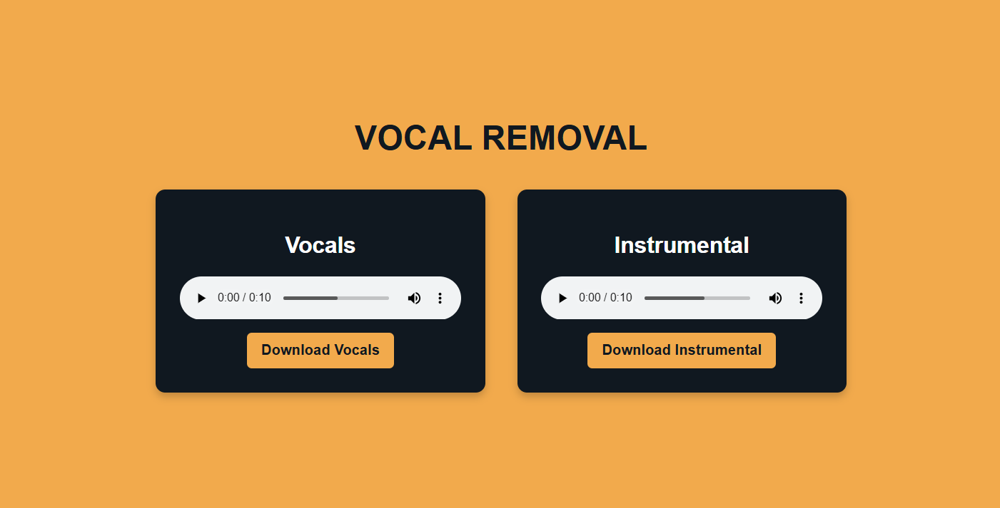
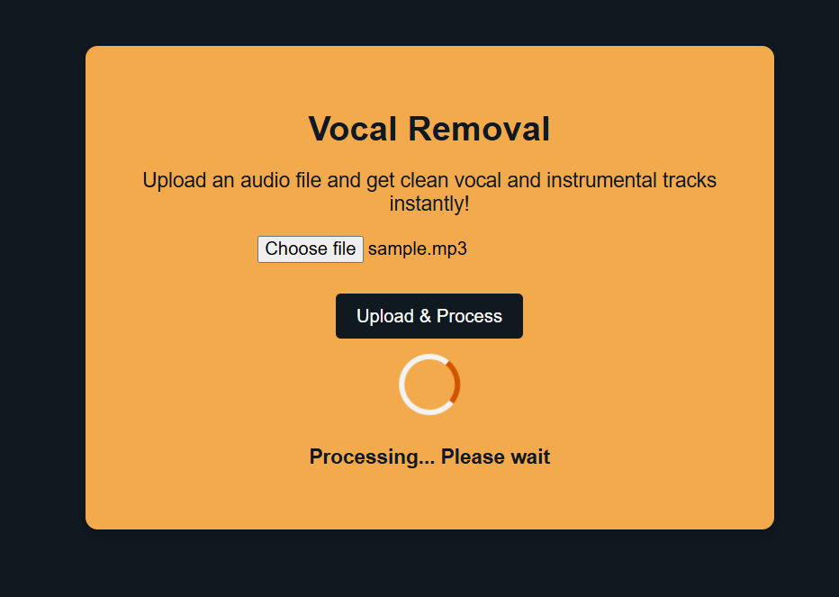
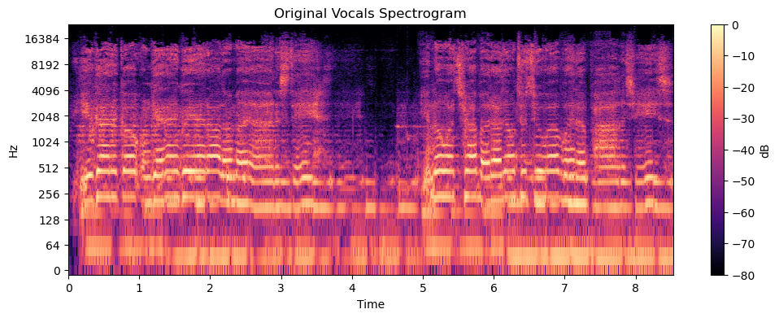
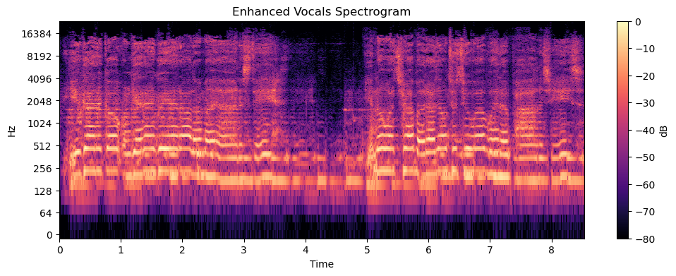
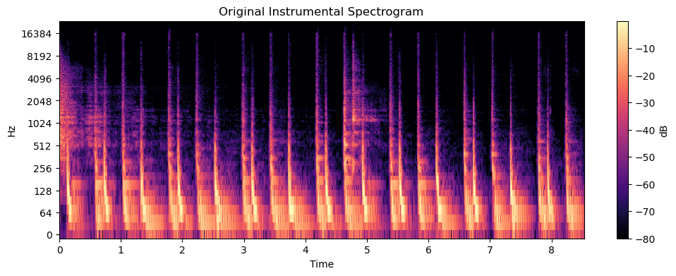
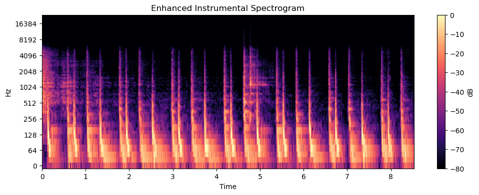

# 🎵 AI Vocal Removal System

An AI-powered Vocal Removal and Music Source Separation system built using Flask, PyTorch, and Demucs Deep Learning architecture to separate vocals and instrumental tracks from audio files.

---

## 🚀 Features

- 🎤 Vocal extraction from songs
- 🎼 Instrumental separation
- 🤖 Deep Learning powered audio processing
- ⚡ Real-time audio source separation
- 🎧 Audio playback and download support
- 📊 Spectrogram and waveform analysis
- 🎨 Responsive web interface
- 🔥 Demucs AI model integration

---

## 🛠️ Tech Stack

### Frontend
- HTML5
- CSS3
- JavaScript

### Backend
- Python
- Flask

### AI / Deep Learning
- PyTorch
- Demucs
- Torchaudio
- Librosa
- NumPy
- SoundFile

---

## 🧠 AI Model

### Model Used
- Hybrid Transformer Demucs (HTDemucs)

### Deep Learning Architecture

:contentReference[oaicite:0]{index=0}

### Audio Sources Separated
- Vocals
- Instrumental
- Drums
- Bass
- Other stems

---

## 📂 Project Structure

```bash
Vocal-Removal-System/
│
├── templates/
│   ├── index.html
│   └── download.html
│
├── static/
│   └── styles.css
│
├── uploads/
├── processed/
├── models/
│   ├── vr.pth
│   └── voice_remove1111.ipynb
│
├── app.py
├── requirements.txt
├── README.md
└── screenshots/
```

---

## ⚙️ System Workflow

1. User uploads audio file
2. Audio preprocessing applied
3. Demucs model performs source separation
4. Vocals extracted
5. Instrumental generated
6. Processed audio saved
7. Download links generated

---

## 🎧 Supported Audio Features

- Stereo audio handling
- Mono-to-stereo conversion
- Audio enhancement filtering
- Spectrogram visualization
- Waveform analysis

---

## 📊 Audio Processing Pipeline

### Processing Steps

- Audio loading
- Waveform conversion
- Source separation
- High-pass filtering
- Low-pass filtering
- Audio reconstruction
- WAV export

---

## 📈 Deep Learning Features

- Transformer-based source separation
- Spectrogram analysis
- Time-frequency audio decomposition
- Multi-source audio extraction
- GPU/CPU inference support

---

## 📸 Screenshots

### 🖥️ Upload Dashboard

<p align="center">
  
</p>

---

### 🎵 Audio Processing

<p align="center">
  
</p>

---

### 🎤 Vocal & Instrumental Output

<p align="center">
  
</p>

---

### 📊 Spectrogram Analysis

<p align="center">
  
</p>

---
<p align="center">
  
</p>

---<p align="center">
  
</p>

---<p align="center">
  
</p>

---

## ▶️ Installation

### 1️⃣ Clone Repository

```bash
git clone https://github.com/KaranBisht111/AI-Vocal-Removal-System
```

---

### 2️⃣ Navigate to Project

```bash
cd Vocal-Removal-System
```

---

### 3️⃣ Install Dependencies

```bash
pip install -r requirements.txt
```

---

### 4️⃣ Run Flask Application

```bash
python app.py
```

---

## 🌐 Access Application

Open browser:

```bash
http://127.0.0.1:5000
```

---

## 📦 Requirements

Main dependencies:

- Flask
- PyTorch
- Torchaudio
- Demucs
- Librosa
- NumPy
- SoundFile
- Matplotlib

---

## 🔬 Model Training & Analysis

The project includes:

- Waveform visualization
- Spectrogram plotting
- Audio filtering
- Model benchmarking
- Inference time analysis
- Enhanced vocal separation

The notebook demonstrates advanced audio processing experiments and Demucs model customization. :contentReference[oaicite:1]{index=1}

---

## ⚡ Performance

| Feature | Status |
|---|---|
| CPU Inference | Supported |
| GPU Inference | Supported |
| Audio Enhancement | Enabled |
| Real-time Processing | Partial |
| Multi-source Separation | Supported |

---

## 🔐 Audio Enhancement

Implemented:
- High-pass filters for cleaner vocals
- Low-pass filters for instrumental refinement
- Noise reduction techniques
- Enhanced source isolation

---

## 🔮 Future Improvements

- Real-time streaming separation
- MP3/WAV/FLAC multi-format support
- WebSocket live processing
- Cloud deployment
- Music remixing tools
- AI karaoke generation
- Batch audio processing
- Voice cloning integration

---

## 📚 Learning Outcomes

This project demonstrates:

- Deep Learning for audio processing
- Source separation techniques
- Transformer-based architectures
- PyTorch inference pipelines
- Audio signal processing
- Spectrogram analysis
- Flask web deployment
- GPU acceleration

---

## 👨‍💻 Author

Karan Bisht

---

## ⭐ Support

If you found this project useful, give it a star ⭐ on GitHub.

---

## 📜 License

This project is licensed under the MIT License.